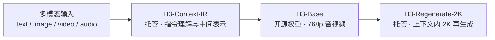

# MiniMax H3 分析笔记

面向研究者与工程师的 **MiniMax H3**（Hailuo 3.0）开放资料整理、架构解读，以及**开源社区发行版对照**。

本仓库**不是**官方推理/训练代码，也**不托管**模型权重。你可以用它快速搞清：

1. H3 系统怎么拆（开源 Base vs 托管 IR / 2K）  
2. 本地怎么部署、硬件大概怎么选  
3. Hugging Face / 社区上有哪些量化、Turbo、ControlNet、FastH3 等发行，各自适合谁  

> 主要依据：[官方开源公告](https://www.minimax.io/news/minimax-h3-open-source)（2026-08-03）、[`MiniMaxAI/MiniMax-H3`](https://huggingface.co/MiniMaxAI/MiniMax-H3)、[H3 Open 资源页](https://design.minimax.io/h3)、Hugging Face Hub API 快照。未核实的数字会标明，**不编造榜单分数**。

## 先看这两份（社区版本）

| 文档 | 适合谁 | 内容 |
| --- | --- | --- |
| **[社区版本手册](docs/community-versions.md)** | 要选型、要硬件建议 | 官方 Base、Comfy-Org、GGUF、Turbo、NF4、NVFP4、ControlNet、FastH3 等**代表性发行**详解 + 硬件档位 |
| **[HF 近 3 个月全量索引](docs/hf-last-3-months.md)** | 要扫全 Hub | **2026-06-11 → 2026-09-11** 共 **315** 个相关仓，按 15 类列出（创建日 / 下载量 / 链接） |

**一分钟选型（摘要）**

| 你的目标 | 建议起点 |
| --- | --- |
| 对齐官方 / 多卡服务 | [`MiniMaxAI/MiniMax-H3`](https://huggingface.co/MiniMaxAI/MiniMax-H3) + SGLang / vLLM |
| ComfyUI 消费级 | [`Comfy-Org/MiniMax-H3`](https://huggingface.co/Comfy-Org/MiniMax-H3) 的 `pruned_int8_convrot` |
| 更低显存 | GGUF / DiffSynth NF4 / WanGP（见社区手册） |
| 更快出片（可接受音质损失） | LightX2V / larryvrh 等 **Turbo** LoRA |
| 线稿/深度/姿态控视频 | `alibaba-pai` **Fun-Controlnet-Union** |
| 少步 T2VA 学生模型 | **FastH3** Preview（仅 T2VA，见手册） |

## 仓库结构

```
minimax-h3-analysis/
├── README.md                 # 本页
├── NOTICE / CONTRIBUTING.md
├── hf_last3m.json            # HF 近 3 个月 API 快照（可复现索引）
└── docs/
    ├── community-versions.md # 社区发行精选手册
    ├── hf-last-3-months.md   # Hub 全量分类索引
    ├── architecture.md       # 架构
    ├── variants.md           # FL2VA / Ref2VA
    ├── capabilities.md       # 能力与提示
    ├── deployment.md         # 部署与 2K 工作流
    ├── comparison.md         # 对比框架（无虚假榜单）
    └── sources.md            # 资料链接
```

## H3 是什么

MiniMax H3 是面向**通用视频生成**的开源全模态系统：统一理解文本 / 图像 / 视频 / 音频上下文，并在**同一次前向**中生成带**原生立体声音频**的视频。

| 项目 | 规格（官方公开信息） |
| --- | --- |
| 参数规模 | 约 **33B** 稠密 Omni-Transformer（约 **13B** 在 AdaLN 相关分支） |
| 文本编码器 | **Qwen3-VL-32B**（取第 50 层 hidden states） |
| 输出时长 | **4–15 秒** |
| 帧率 | **24 FPS** |
| 分辨率 | 开源 Base 默认短边约 **768p**；官方 **2K** 走 `H3-Regenerate-2K`（托管） |
| 音频 | **32 kHz 立体声**，与画面同生（非后期配音） |
| 画幅 | 含 21:9、16:9、4:3、1:1、3:4、9:16 等 |
| 对白语言 | 稳定 11 语：ar / zh / en / fr / de / it / ja / ko / pt / ru / es |

## 三件套：开源 vs 托管



| 模块 | 是否开源 | 作用 |
| --- | --- | --- |
| **H3-Context-IR** | 否（API） | 复杂多模态指令 → Context Intermediate Representation |
| **H3-Base** | **是**（FL2VA / Ref2VA） | 生成 **768p** 视频 + 立体声 |
| **H3-Regenerate-2K** | 否（API） | 768p + 原上下文 → **2K** in-context 再生成 |

本地可只跑 Base 做 768p；要官方级 2K 或完整 IR，需对接 MiniMax Open Platform。

## 两个开源检查点

| Checkpoint | 任务 | 典型输入 |
| --- | --- | --- |
| **FL2VA** | Text / First-Last-Frame → Audio-Video | 纯文本；或首帧 / 末帧 / 首末帧 |
| **Ref2VA** | Omni-reference → Audio-Video | 文本 + ≤9 图 / ≤3 视频 / ≤3 音频（跨类型 ≤12；音频不能单独作为唯一输入） |

```bash
hf download MiniMaxAI/MiniMax-H3 --include "model_index.json" "FL2VA/*" "Ref2VA/*" --local-dir MiniMax-H3
```

国内镜像：[ModelScope `MiniMax/MiniMax-H3`](https://www.modelscope.cn/models/MiniMax/MiniMax-H3)（整库体积很大，请按需 `--include`）。

## 架构速览

- **Packed 多模态序列** + **MM-RoPE**（t, h, w）→ Omni-Transformer  
- **VisualVAE** `f16t4d24`，再 `1×2×2` patchify（视觉 token 约 32× 空间下采样）  
- **AudioVAE** 立体声分通道，约 **40 Hz** latent  
- **AdaLN** 可缓存；社区常做 AdaLN **剪枝**以减小消费级体积  
- 首发开源推理为 **full attention**；sparse attention 后续单独发布  

详见 [`docs/architecture.md`](docs/architecture.md)。

## 本地部署入口

官方推荐：SGLang、vLLM / vLLM-Omni、diffusers、ComfyUI。详见 [`docs/deployment.md`](docs/deployment.md)。

```bash
sglang serve   --model-path MiniMaxAI/MiniMax-H3   --num-gpus 4   --ulysses-degree 4   --performance-mode speed   --host 0.0.0.0   --port 30010   --model-variant fl2va
```

消费级单卡请优先看 [社区版本手册 · 硬件总表](docs/community-versions.md#8-硬件总表把版本映射到机器)，而不是直接拉全量 BF16。

## 文档导航

| 文档 | 内容 |
| --- | --- |
| [社区版本手册](docs/community-versions.md) | 精选开源/社区发行：下载、发布方、特点、硬件 |
| [HF 近 3 个月全量索引](docs/hf-last-3-months.md) | Hub 上 315 仓分类全表 |
| [架构分析](docs/architecture.md) | Encoder / VAE / Transformer / 2K |
| [模型变体](docs/variants.md) | FL2VA vs Ref2VA |
| [能力与提示](docs/capabilities.md) | I/O、Context-IR、护栏 |
| [部署指南](docs/deployment.md) | 本地 768p 与 Full 2K 工作流 |
| [对比与定位](docs/comparison.md) | 对比框架（无虚假榜单） |
| [资料索引](docs/sources.md) | 一手与二次链接 |

## 许可证

上游权重遵循 **MiniMax H3 Community License Agreement**（含地域与商业门槛）。本仓仅文档整理；使用权重前请阅读官方许可与 [License Q&A](https://www.minimax.io/news/minimax-h3-open-source)。见 [`NOTICE`](NOTICE)。

## 贡献

纠错、补链接、补新发行欢迎 PR，见 [`CONTRIBUTING.md`](CONTRIBUTING.md)。新增 HF 仓时：精选详解进 `community-versions.md`，全量索引可复扫 `hf_last3m.json` 后更新 `hf-last-3-months.md`。

## English summary

**MiniMax H3** (~33B) generates **video + native stereo audio** in one pass (4–15s, 24fps). Open weights cover **H3-Base** (**FL2VA** / **Ref2VA**) at ~768p; **Context-IR** and **Regenerate-2K** stay hosted.

This repo is **docs-only**: architecture notes, deployment pointers, a curated [community release handbook](docs/community-versions.md), and a [full Hugging Face index for the last ~3 months](docs/hf-last-3-months.md) (315 repos). No model weights are hosted here.
