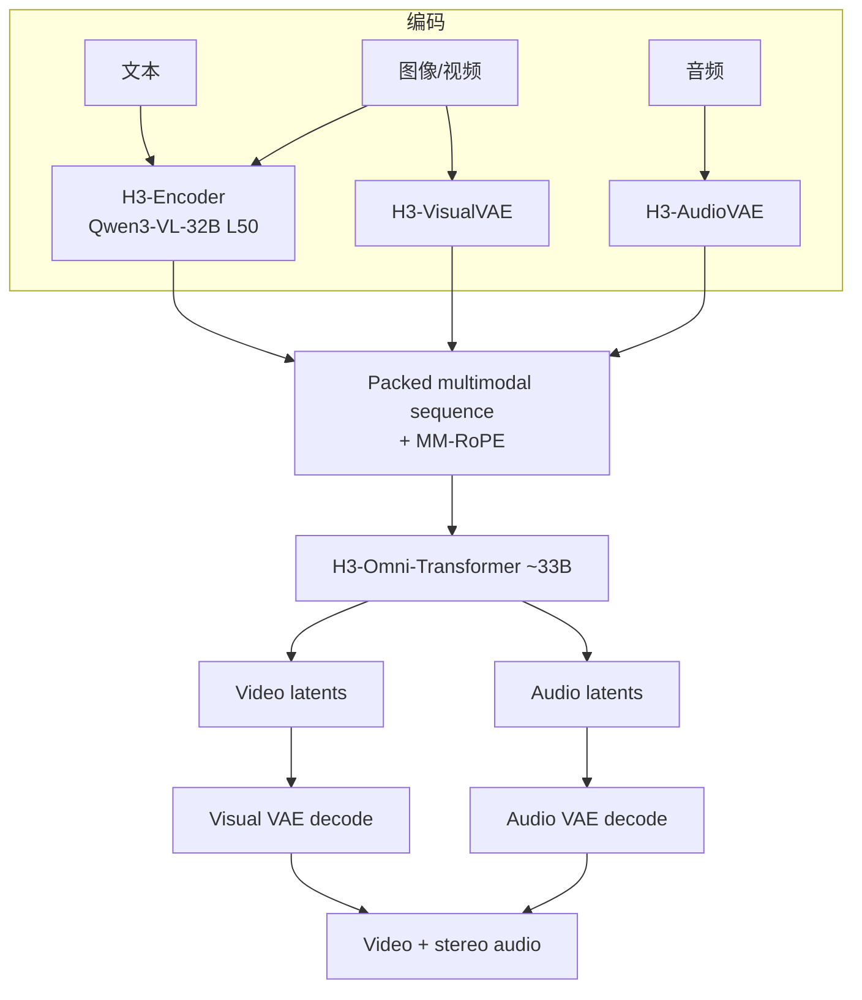

# MiniMax H3 架构分析

依据：[Open General Intelligence: MiniMax H3 Is Now Open Source](https://www.minimax.io/news/minimax-h3-open-source)。

## 1. 系统分层

H3 不是单一 checkpoint，而是 **预处理 + 基础生成 + 高分辨率再生成** 的组合：

1. **H3-Context-IR**（托管）  
   对自由形式的多模态输入做指令解析、跨模态关联、时间理解与逻辑补全，序列化为 Base 可消费的中间表示。官方强调它对最终质量至关重要；因多阶段托管流水线，**未随 Base 开源**，提供 API，并给出 Prompting Guidance 供社区自建预处理。

2. **H3-Base**（开源）  
   在 IR / 提示条件下联合预测视频与音频 latent，解码为 **768p** 级视频 + **32 kHz** 立体声。

3. **H3-Regenerate-2K**（托管）  
   不以传统独立超分为主路径，而是把低分辨率结果与**原始上下文**一并再送入 H3，做 **in-context 2K 再生成**，以保留小字与细粒度细节。模块复杂，首发未开源，提供 API。

## 2. H3-Base 数据流

要点：

- 文本与视觉相关表示可经 **H3-Encoder**；视觉另经 **VisualVAE**；音频仅经 **AudioVAE**。
- Omni-Transformer **联合**预测视频与音频 latent。
- 长序列成本高：原生支持稀疏注意力训练/推理，但**初始开源推理为 full attention**。

## 3. H3-Encoder

- 使用 **Qwen3-VL-32B** 完整预训练权重。
- 向 Omni-Transformer 提供第 **50** 层 hidden states。
- 词表含若干特殊 token（如官方文档中的模态/控制相关 token）；必须使用仓库内提供的 tokenizer 与配置。

## 4. H3-VisualVAE

- 时空因果视频自编码器：**空间压缩 16×、时间压缩 4×、24 latent 通道** → **f16t4d24**。
- 进入 Transformer 前再做 `(t, h, w)` 上 **`1×2×2` patchify** → 视觉 token 等效空间下采样约 **32×**，时间仍为 **4×**。
- 对 latent 空间做了面向重建质量与可学习性的优化；encoder 训练后另训基于 ViT 的 decoder，以降解码成本并提升重建。

## 5. H3-AudioVAE

- 左右声道 **共享** encoder/decoder，**分通道**处理后再合并 → 支持立体声 I/O。
- 每通道：32 kHz → 时间率约 **40 Hz** 的 latent token 序列。
- 设计灵感提及 VA-VAE：在重建质量与生成可学性之间折中。

## 6. H3-Omni-Transformer

- **~33B** 参数稠密单流 Transformer；约 **13B** 位于 AdaLN 相关分支。
- Attention / FFN **无**按模态拆分的结构；模态专用参数主要在 I/O 与 AdaLN。
- **MM-RoPE**：三维多模态旋转位置编码，覆盖时间与两个空间维 `(t, h, w)`。
- 发布的 checkpoint 为 **CFG-distilled** Omni Transformer 权重（以官方 model card / 公告为准）。
- AdaLN 调制可预计算缓存 → 纯推理部署可不加载对应参数；完整权重仍发布以支持微调等开发。

## 7. H3-Regenerate-2K 的设计意图

官方给出的两点优势：

1. 尽量复用 Base 本身的生成能力，而不是另训一个窄域超分头。  
2. In-context 形式能把原始多模态上下文带进高分辨率阶段，有利于恢复常规超分只能「猜」的细节（如小字）。

这也被表述为 **任务泛化** 的例子：同一套生成先验服务「提高分辨率」任务。

## 8. 分析者视角的开放问题

以下内容公开材料未给出完整细节，适合后续跟踪（勿填假数据）：

- Context-IR 内部多阶段模型清单与延迟/成本曲线  
- Sparse attention 开源时间表与和 full attention 的质量差  
- 各框架（SGLang / vLLM / diffusers / ComfyUI）在相同种子下的可复现性矩阵  
- AdaLN 缓存后的实际显存占用 vs 完整权重微调占用  

有一手实测欢迎在 PR 中补充，并标注硬件与软件版本。
