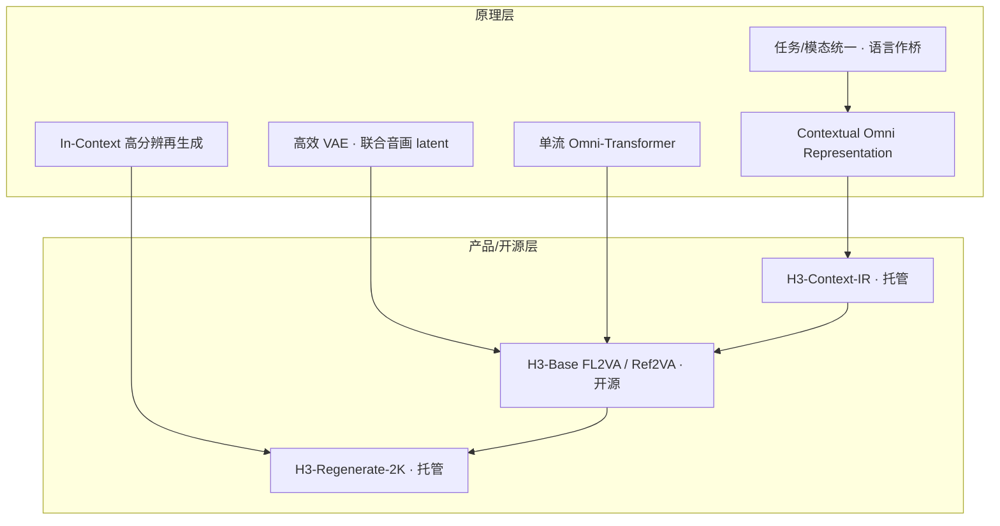

# MiniMax H3 原理知识

  
  
  
  

> [!IMPORTANT]
> **本页定位**：仓库的**原理知识板块**——用可核对的一手材料，把 H3「为什么这样设计、关键机制做什么」讲清楚。  
> **和架构页的关系**：本页偏**原理与设计动机**；[`architecture.md`](architecture.md) 偏**模块数据流与实现细节**。  
> **阅读约定**：外文一手材料均已**译成中文**陈述；需要对照原文时，见各节「原文摘录 + 原地址」。未公开处标「未公开 / 待 Tech Report」。

> [!NOTE]
> **维护规则**：每小时复查官方博客 / 开源公告 / Open Platform API / Hub 卡页 / Tech Report（若已发布）。有新知识则改正文，并在文末「知识更新日志」追加一行。社区量化、蒸馏、剪枝经验**不得**写成官方论文结论。

---

## 目录

| 章节 | 内容 | 阅读重点 |
| :---: | --- | --- |
| [0](#0-知识来源总表一手) | 知识来源总表 | 每条论断可回溯到 URL |
| [1](#1-一句话抓住核心) | 一句话核心 | 最先读 |
| [2](#2-设计第一性打破任务与模态边界) | 任务 / 模态统一 | 设计哲学 |
| [3](#3-contextual-omni-representation--context-ir) | Context-IR | 指令遵循的根 |
| [4](#4-h3-vae压缩重建与可学习性) | H3-VAE | 效率与 2K 底座 |
| [5](#5-h3-omni-transformer为任务泛化服务的架构) | Omni-Transformer | 主干结构 |
| [6](#6-in-context-regeneration2k) | In-Context 2K | 为何不是传统超分 |
| [7](#7-系统分层原理如何落到能跑什么) | 系统分层 | 本地 vs 完整官方路径 |
| [8](#8-与-fl2va--ref2va-的关系) | FL2VA / Ref2VA | 两个权重同一套原理 |
| [9](#9-读原理时的常见误区) | 常见误区 | 避坑 |
| [10](#10-推荐阅读顺序) | 阅读顺序 | 进阶 |
| [11](#11-待核实--开放问题) | 开放问题 | 跟踪中 |
| [12](#12-知识更新日志) | 更新日志 | 版本履历 |

---

## 0. 知识来源总表（一手）

> [!TIP]
> **怎么读代号**：正文里的 `[BLOG]`、`[OSS]` 等，都能在本表点开**原地址**。外文标题下附中文译名。

| 代号 | 中文说明 | 原标题（原文语言） | 日期 / 类型 | 原地址 |
| :---: | --- | --- | --- | --- |
| **[BLOG]** | MiniMax 研究博客：H3 打破任务与模态边界 | *MiniMax H3: An Open Model Breaking the Boundaries Between Tasks and Modalities*（英文） | 2026-07-31 · 研究博客 | [打开原文](https://www.minimax.io/blog/minimax-h3) |
| **[OSS]** | MiniMax 开源公告：H3 正式开源 | *Open General Intelligence: MiniMax H3 Is Now Open Source*（英文） | 2026-08-03 · 新闻公告 | [打开原文](https://www.minimax.io/news/minimax-h3-open-source) |
| **[API-IR]** | Open Platform：创建 H3-Context-IR 任务 | *Create H3-Context-IR Task*（英文） | API 参考 | [打开原文](https://platform.minimax.io/docs/api-reference/video-generation-v2-h3-context-ir) |
| **[API-R2K]** | Open Platform：创建视频再生成任务 | *Create Video Regeneration Task*（英文） | API 参考 | [打开原文](https://platform.minimax.io/docs/api-reference/video-generation-v2-regeneration) |
| **[API-GEN]** | Open Platform：创建视频生成任务（含 H3 / H3-Max 模型字段） | *Create Video Generation Task*（英文） | API 参考 | [打开原文](https://platform.minimax.io/docs/api-reference/video-generation-v2-create) |
| **[GUIDE]** | Open Platform：视频生成指南（H3 与 H3 Max） | *Video Generation guides*（英文） | 产品指南 | [打开原文](https://platform.minimax.io/docs/guides/video-generation) |
| **[HF]** | Hugging Face：`MiniMaxAI/MiniMax-H3` 模型卡 | Model card / repo docs（英文为主） | Hub | [打开原文](https://huggingface.co/MiniMaxAI/MiniMax-H3) |
| **[TR]** | H3 技术报告 | *H3 Technical Report*（预告） | **待发布** | — |

社区二手材料若引用，会单独写明并降权，不与上表混排。

---

## 1. 一句话抓住核心

> [!IMPORTANT]
> **核心结论（中文）**  
> H3 把过去按任务切开的「文生图 / 图生视频 / 参考 / 编辑 / 配音」等能力，收成**统一的多模态上下文理解 + 原生音视频同生**。语言是打通任务边界的桥梁；系统再配 **Contextual Omni Representation（研究叙述）/ Context-IR（产品模块）**、**H3-VAE**、**H3-Omni Transformer**，以及用 **In-Context Regeneration** 做 2K——而不是单独训练传统超分头。

**公开产品叙事（中文归纳）**：统一理解文本 / 图像 / 视频 / 音频上下文，生成带**原生立体声**的视频，最长约 **15 秒**，分辨率可达 **2K**（完整 2K 路径依赖 Regenerate-2K）。

**依据**：[BLOG] · [OSS]  
**原地址**：[研究博客](https://www.minimax.io/blog/minimax-h3) · [开源公告](https://www.minimax.io/news/minimax-h3-open-source)

<b>原文摘录（英文 → 对照）</b>

> H3 understands unified context across text, images, video, and audio, generating video with native stereo sound, up to 15 seconds at 2K resolution.  
> —— [BLOG](https://www.minimax.io/blog/minimax-h3)

**中文对照**：H3 统一理解文本、图像、视频与音频上下文，生成带原生立体声的视频，最长约 15 秒，分辨率可达 2K。

---

## 2. 设计第一性：打破任务与模态边界

### 2.1 第一原则

> [!IMPORTANT]
> **中文要点**  
> 前代 Hailuo / Hailuo 系列之后，H3 的第一原则是：**跨任务统一与泛化（unify and generalize across tasks）**。

**依据**：[BLOG] 小节 *Breaking the Boundaries Between Tasks*  
**原地址**：https://www.minimax.io/blog/minimax-h3

### 2.2 过去常见的割裂

| 领域 | 典型割裂（中文） | 依据 |
| :---: | --- | :---: |
| **图像** | 文生图、编辑、主体参考、运动参考、风格参考分属不同专家模型 | [BLOG] |
| **音频** | 人声、音效、音乐分域研究 | [BLOG] |
| **视频** | 文生视频、图生视频、首末帧、主体/运动/音色参考、视频编辑彼此分家；图 / 视 / 音之间也有硬边界 | [BLOG] |

这些边界既限制创作自由度，也限制训练期泛化。H3 的回应：在**预训练阶段**就把多模态理解与生成能力做宽，而不是后期拼很多专用头。

<b>原文摘录（英文 → 对照）</b>

> So the first principle guiding H3's development was unifying and generalizing across tasks.  
> —— [BLOG](https://www.minimax.io/blog/minimax-h3)

**中文对照**：因此，指导 H3 研发的第一原则，是跨任务的统一与泛化。

### 2.3 预训练范式（公开摘要）

| 关注点 | 中文要点 | 依据 |
| :---: | --- | :---: |
| **数据与任务** | 文生图；文生视频（音频**原生立体声**同生）；原生多镜头；文生音频（人声/音效/音乐**不拆开**联合建模）；广义参考与编辑（图→图、图→视、音→音、音视频→音视频） | [BLOG] |
| **广义参考与编辑** | 尽量来自真实自然数据；关系用**自然语言**表达，不锁死在固定任务表——语言是通往泛化的桥 | [BLOG] |
| **架构与训练** | 尽早融合多样数据类型与任务；**混合比例（mixing ratio）** 被强调为关键 | [BLOG] |

> [!NOTE]
> **应用侧定性（中文）**：创作者越来越用自然语言描述完整创作意图；模型从「生成一个片段」走向更深地参与内容生产流程。  
> **依据**：[BLOG] · **原地址**：https://www.minimax.io/blog/minimax-h3

---

## 3. Contextual Omni Representation / Context-IR

### 3.1 原理：用语言统一「任务」

> [!IMPORTANT]
> **中文要点**  
> 官方加强 **captioning（多模态描述）**：不只描述目标视频，还要描述**上下文与目标的关系**、上下文内部元素关系，并**联合描述视频与音频**。  
> 这被称作 **Contextual Omni Representation（情境全模态表征）**：语言充当可泛化的桥梁与解释器，把封闭任务表改写成开放描述——这是 H3 **指令遵循能力**的根。

**依据**：[BLOG] *H3-Contextual Omni Representation*  
**原地址**：https://www.minimax.io/blog/minimax-h3

| 公开数字（以博客为准） | 说明 | 状态 |
| --- | --- | :---: |
| 约 **100K tokens** 推理 | 多数素材全模态理解流水线的推理量级 | 博客摘要 |
| 蒸馏到平均约 **4K tokens** | 再压缩供后续生成使用 | 博客摘要 |
| 完整算法细节 | — | **待 [TR]** |

<b>原文摘录（英文 → 对照）</b>

> This is fundamentally a form of Contextual Omni Representation, where language acts as the generalizable bridge and interpreter, unifying "tasks" into an open, descriptive form. This is the root of H3's broad instruction-following ability.  
> —— [BLOG](https://www.minimax.io/blog/minimax-h3)

**中文对照**：这本质上是一种情境全模态表征：语言作为可泛化的桥梁与解释器，把「任务」统一成开放的描述形式。这是 H3 广泛指令遵循能力的根源。

> Most source material requires around 100K tokens of inference, distilled down to an average of roughly 4K tokens.  
> —— [BLOG](https://www.minimax.io/blog/minimax-h3)

**中文对照**：多数原始素材约需 10 万 token 量级的推理，再蒸馏到平均约 4 千 token。

### 3.2 产品模块：H3-Context-IR（托管）

| 要点 | 中文说明 | 依据 |
| :---: | --- | :---: |
| **角色** | 自由形式多模态输入的预处理与编排：指令解析、跨模态关联、时间理解、复杂逻辑 | [OSS][API-IR] |
| **输出** | 序列化为 Base 更易消费的 **Context Intermediate Representation（上下文中间表示）**——增强后的结构化提示 | [OSS][API-IR] |
| **语义补全** | 在不偏离用户意图的前提下，可补充欠定语义 | [OSS][API-IR] |
| **开源边界** | 多阶段托管流水线 → **未随 Base 开源**；提供 API，并鼓励按 Prompting Guidance 自建预处理 | [OSS] |
| **API 用法** | 异步任务；成功后取出增强提示，再交给生成 | [API-IR][GUIDE] |
| **输入互斥** | 首末帧模式（`first_frame` / `last_frame`）与参考模式（`reference_image` / `reference_video` / `reference_audio`）**不可混用** | [API-IR][API-GEN] |
| **提示长度** | Context-IR / 生成请求中单条 `text` 最长约 **7000** 字符；再生成（`base_video`）路径的最终 prompt 上限约 **40000** 字符 | [API-IR][API-GEN][API-R2K] |

> [!WARNING]
> **原理含义**：本地只跑 Base，等于在「跳过或自行近似」这一层表示学习——质量差距往往出在这里，而不只是采样步数。  
> **依据**：[OSS] · **原地址**：https://www.minimax.io/news/minimax-h3-open-source

<b>API 原文要点（英文 → 对照）</b>

> H3-Context-IR deeply interprets multimodal context across text, images, audio, and video… converts that understanding into a structured representation with richer semantic detail while preserving the user's original intent as much as possible.  
> —— [API-IR](https://platform.minimax.io/docs/api-reference/video-generation-v2-h3-context-ir)

**中文对照**：H3-Context-IR 深入理解文本、图像、音频、视频等多模态上下文……在尽量保留用户原意的前提下，把理解结果转成语义更丰富的结构化表示。

---

## 4. H3-VAE：压缩、重建与可学习性

> [!IMPORTANT]
> **中文要点**  
> H 系列持续迭代 tokenizer；H3 **彻底重做**前代 tokenizer，在**重建质量**与**可学习性**上全面提升。高压缩率带来约 **4× 有效序列长度收益**，显著降低训推成本，并支撑**原生 2K**相关能力叙事。

**依据**：[BLOG] · [OSS]  
**原地址**：[研究博客](https://www.minimax.io/blog/minimax-h3) · [开源公告](https://www.minimax.io/news/minimax-h3-open-source)

| 组件 | 中文要点 | 依据 |
| :---: | --- | :---: |
| **VisualVAE** | 时空因果；空间 **16×**、时间 **4×**、**24** latent 通道；进入 Transformer 前再做 `1×2×2` patchify → 视觉 token 等效约 **32×** 空间下采样、时间仍为 **4×**；编码器训完后另训 ViT 解码器，以降解码成本、提重建质量 | [OSS] |
| **AudioVAE** | 左右声道共享编解码、分通道处理再合并；约 **32 kHz → 40 Hz** latent；受 **VA-VAE** 思路启发优化 latent | [OSS] |

> [!TIP]
> **原理读法**：VAE 在**重建保真**与**生成可学**之间做折中；序列长度收益直接决定能否在可接受算力下吃下更长的音画联合上下文。

<b>原文摘录（英文 → 对照）</b>

> With H3, we completely overhauled our previous tokenizer, achieving across-the-board gains in reconstruction quality and learnability… Its high compression ratio also delivers a 4x gain in effective sequence length… and it's the key technology behind our native 2K resolution support.  
> —— [BLOG](https://www.minimax.io/blog/minimax-h3)

**中文对照**：在 H3 上我们彻底重做了此前的 tokenizer，重建质量与可学习性全面提升……高压缩率还带来约 4 倍有效序列长度收益……也是原生 2K 分辨率支持的关键技术。

---

## 5. H3-Omni Transformer：为任务泛化服务的架构

### 5.1 哲学：「架构应服务于任务」

> [!IMPORTANT]
> **中文要点**  
> 通用与高效是唯二目标。为此**放下**曾有优势的 Hailuo-02 类架构——在以任务泛化为中心的定义下，它会引入多余复杂性。  
> **金句（中文转述）**：任务泛化是不可逆趋势，架构技巧应为模型定义让路。

**依据**：[BLOG]  
**原地址**：https://www.minimax.io/blog/minimax-h3

<b>原文摘录（英文 → 对照）</b>

> We believe task generalization is an irreversible trend, and architectural tricks should give way to how the model is defined.  
> —— [BLOG](https://www.minimax.io/blog/minimax-h3)

**中文对照**：我们认为任务泛化是不可逆的趋势，架构上的技巧应当让位于模型本身的定义方式。

### 5.2 公开结构要点

| 要点 | 中文内容 | 依据 |
| :---: | --- | :---: |
| **规模** | 约 **33B** 稠密单流 Transformer；约 **13B** 在 AdaLN 相关分支；AdaLN 调制可预计算缓存 → 纯推理可不加载对应参数；完整权重仍发布以便微调 | [OSS] |
| **模态结构** | Attention / FFN **无**按模态拆分；模态专用主要在 I/O 与 AdaLN | [OSS] |
| **位置编码** | **MM-RoPE**：三维多模态旋转位置编码，覆盖 `(t, h, w)` | [OSS] |
| **输入编码** | 文本经 H3-Encoder（完整加载 **Qwen3-VL-32B** 预训练权重，向 Omni-Transformer 提供其**第 50 层** hidden states）；视觉 = Encoder + VisualVAE；音频 = AudioVAE；再打包成统一序列 | [OSS][HF] |
| **输出** | 联合预测视频与音频 latent，再分别解码 | [OSS] |
| **稀疏注意力** | 训练后期引入原生 sparse attention；**首发开源推理为 full attention**，稀疏实现后续单独发布 | [OSS] |
| **发布权重** | **CFG 蒸馏**后的 Omni Transformer（以卡页 / 公告为准） | [OSS][HF] |

**依据总入口**：[OSS] https://www.minimax.io/news/minimax-h3-open-source

### 5.3 训练系统侧

多模态上下文使序列长度方差约 **3×**；理解与生成算力更异构。官方称采用理解 / 生成负载分离的训练架构，并联合平衡样本内异构算力与样本间负载，端到端训练吞吐提升近 **30%**。实现细节 **待 [TR]**。

**依据**：[BLOG] · **原地址**：https://www.minimax.io/blog/minimax-h3

### 5.4 与社区「剪枝」的关系

> [!CAUTION]
> 社区常见 AdaLN / 曲线预计算剪枝，使消费级体积下降，是对「AdaLN 可缓存」的工程利用（对照 [OSS]），**不等于**改写官方任务泛化定义；数值通常非 bit-identical。  
> **性质**：本仓库归纳，**非**官方论文结论。

---

## 6. In-Context Regeneration（2K）

> [!IMPORTANT]
> **中文要点**  
> 对 2K，官方**不用**传统独立超分模块，而是让 Base **in-context 再生成**自己的低分辨率结果：  
> 1）尽量复用 Base 已有生成能力；  
> 2）再带上原始多模态上下文，恢复传统超分常只能「猜」的细节（如小字）。  
> 这也被当作**任务泛化**的例子。

**依据**：[BLOG] · [OSS] · [API-R2K] · [GUIDE]  
**原地址**：
- https://www.minimax.io/blog/minimax-h3
- https://www.minimax.io/news/minimax-h3-open-source
- https://platform.minimax.io/docs/api-reference/video-generation-v2-regeneration

| 产品约束 | 中文说明 | 依据 |
| :---: | --- | :---: |
| **开源** | **H3-Regenerate-2K** 因系统复杂**尚未开源**，提供 API | [OSS] |
| **不是通用超分** | 只接受符合 MiniMax-H3 **768P 输出规格**的源视频再生成到 2K；对任意视频做通用放大**不在**该接口能力内 | [API-R2K] |
| **两种合法输入（二选一）** | ① `source_task_id`：复用本账号已成功的 `/v2/video_generation` 任务输出（需白名单，且任务仍在约 7 天可查询窗口内）；② `content` 中恰好一项 `role=base_video` 的源视频，并附上生成该 768P 时**实际**送入模型的文本与参考素材 | [API-R2K] |
| **最终提示** | `base_video` 模式下，文本必须是生成 768P 时**实际送给模型**的最终 prompt，**不是** Context-IR 处理前的原始用户提示；参考图/视/音也须一致 | [API-R2K][GUIDE] |
| **768P 源视频规格（摘要）** | 必须有音轨；**24 fps**；宽/高均可被 **32** 整除；面积约在 **768×768～768×1344**；总帧数 **107–362**（步长 17，约 4–15 秒）——这些规格把「什么叫官方 768P 输出」钉死，也解释了为何不能拿任意片源当超分输入 | [API-R2K] |

> [!WARNING]
> **原理含义**：2K 质量强依赖「低分结果 + 原（最终）上下文」。只放大像素、丢掉上下文，就偏离官方路径。

<b>原文摘录（英文 → 对照）</b>

> For H3's 2K output, instead of using a conventional dedicated super-resolution module, we have the H3 base model regenerate its own low-resolution output in-context.  
> —— [BLOG](https://www.minimax.io/blog/minimax-h3)

**中文对照**：对 H3 的 2K 输出，我们不使用传统的专用超分模块，而是让 H3 基座模型以 in-context 方式再生成自己的低分辨率结果。

> This endpoint only regenerates videos that meet the MiniMax-H3 768P output specifications to produce 2K output. It is not a general-purpose video upscaling endpoint.  
> —— [API-R2K](https://platform.minimax.io/docs/api-reference/video-generation-v2-regeneration)

**中文对照**：该接口只把符合 MiniMax-H3 768P 输出规格的视频再生成到 2K，**不是**通用视频放大接口。

---

## 7. 系统分层：原理如何落到「能跑什么」

**依据**：[OSS] · [GUIDE]  
**原地址**：https://www.minimax.io/news/minimax-h3-open-source

| 你只部署… | 你实际在用的原理子集 | 依据 |
| --- | --- | :---: |
| 仅 Base 768p | VAE + Omni-Transformer +（自建或省略的）提示 / IR 近似 | [OSS] |
| Base + Context-IR API | 加上官方 Contextual Omni 流水线 | [OSS] |
| Base + IR + Regenerate-2K | 完整公开叙事的官方质量路径 | [OSS][GUIDE] |

### 7.1 与 MiniMax-H3-Max 的边界（避免原理混淆）

> [!IMPORTANT]
> **中文要点**  
> Open Platform 并列提供 **`MiniMax-H3`** 与 **`MiniMax-H3-Max`**。后者是 MiniMax 与 **fal.ai** 联合发布、由 fal.ai 在 **MiniMax H3 开源权重上后训练**、面向**高速生成**的变体——**不是**本页所讲「Context-IR → Base 768P → In-Context Regeneration 2K」同一条官方原理栈的别名。

| 对照项 | MiniMax-H3（本页主线） | MiniMax-H3-Max | 依据 |
| :---: | --- | --- | :---: |
| **定位** | 开源通用多模态视频模型；完整 2K 路径依赖托管 IR / Regenerate-2K | fal 后训练的高速变体；平台称生成更快 | [GUIDE][API-GEN] |
| **分辨率** | `768P` / `2K` | `480P` / `768P`（**不支持 2K**） | [API-GEN][GUIDE] |
| **时长** | 4–15 秒 | 5–15 秒（**不支持 4 秒**） | [API-GEN][GUIDE] |
| **与本页原理关系** | Contextual Omni / VAE / Omni-Transformer / In-Context 2K 的主叙事对象 | 后训练 + 推理优化产物；**不应**把速度收益写成 H3 Tech Report 级架构结论 | [GUIDE][API-GEN] |
| **额外字段** | — | 可有 `extra.prompt_expansion_mode`（`disabled` / `balanced` 默认 / `quality`） | [API-GEN] |

**依据**：[GUIDE] · [API-GEN]  
**原地址**：[视频生成指南](https://platform.minimax.io/docs/guides/video-generation) · [创建视频生成任务](https://platform.minimax.io/docs/api-reference/video-generation-v2-create)

<b>原文摘录（英文 → 对照）</b>

> MiniMax H3 Max: jointly released by MiniMax and fal.ai; a video generation model post-trained by fal.ai on MiniMax H3 and optimized for high-speed generation. It delivers mainstream 480P and 768P output and generates faster than MiniMax H3.  
> —— [GUIDE](https://platform.minimax.io/docs/guides/video-generation)

**中文对照**：MiniMax H3 Max 由 MiniMax 与 fal.ai 联合发布；是 fal.ai 在 MiniMax H3 上后训练、面向高速生成优化的视频模型。主流输出为 480P 与 768P，生成速度快于 MiniMax H3。

> `MiniMax-H3-Max`: the fast generation variant… `480P` / `768P` resolution, `2K` is not supported; 5–15s duration.  
> —— [API-GEN](https://platform.minimax.io/docs/api-reference/video-generation-v2-create)

**中文对照**：`MiniMax-H3-Max` 为快速生成变体……分辨率 `480P` / `768P`，**不支持 2K**；时长 5–15 秒。

> [!CAUTION]
> fal 侧评测排名、吞吐倍数等营销数字**不**写入本页原理结论；需要对照时另查 fal 公告，并降权为合作方叙述。

---

## 8. 与 FL2VA / Ref2VA 的关系

> [!NOTE]
> 两个 checkpoint 是**任务专用权重**，不是两套不同哲学——共享同一套 Omni + VAE 原理。

**依据**：[OSS] · **原地址**：https://www.minimax.io/news/minimax-h3-open-source

| Checkpoint | 条件接口（中文规格摘要） | 依据 |
| :---: | --- | :---: |
| **FL2VA** | 文生 / 首末帧：0–2 张图（无图 = 文生视频；单图 = 首或末帧；双图 = 首末帧） | [OSS] |
| **Ref2VA** | 多参考：图 ≤9；视频 ≤3 段且各约 2–15s、总时长 ≤15s；音频 ≤3 段（须伴随图/视，不能单独作唯一输入）；**混合输入全类型文件总数 ≤12** | [OSS][GUIDE] |

**系统级 I/O 摘要（中文）**：输出时长约 **4–15s**；短边默认 **768**；帧率 **24 FPS**；音频约 **32 kHz 立体声**；多种画幅比；对话语言稳定支持 **11** 种（阿拉伯语、中文、英语、法语、德语、意大利语、日语、韩语、葡萄牙语、俄语、西班牙语；其余语言程度不一）。[OSS][HF]

详见 [`variants.md`](variants.md)。

---

## 9. 读原理时的常见误区

| # | 误区 | 正确对照（中文） | 依据 |
| :---: | --- | --- | :---: |
| 1 | 把 H3 当成「只有一个扩散 UNet」 | 实际是 Encoder + 双 VAE + Omni-Transformer 联合系统，音视频同前向 | [OSS] |
| 2 | 以为开源 = 完整官方 2K 体验 | IR 与 2K 再生成仍托管 | [OSS] |
| 3 | 用传统超分替代 Regenerate-2K 并声称等价 | 官方路径强调上下文再利用；API 亦非通用超分 | [BLOG][API-R2K] |
| 4 | 把 Turbo / FastH3 / **H3-Max** 当成「同一原理的无损加速」或完整 2K 官方路径 | H3-Max 是 fal 后训练高速变体（平台并列模型）；**无 2K**、时长与分辨率约束也不同；社区 Turbo 更勿与一手原理混谈 | [GUIDE][API-GEN][BLOG][OSS] |
| 5 | 把社区量化剪枝当成架构论文结论 | 多为部署优化；AdaLN 可缓存见开源公告 | [OSS] |
| 6 | 以为首末帧与多参考可在一次请求里混用 | API 明确两套角色互斥，不能混装 | [API-IR][API-GEN] |

---

## 10. 推荐阅读顺序

1. **本页**（原理地图 + 中文转述 + 原地址）  
2. [`architecture.md`](architecture.md)（数据流与模块规格）  
3. [`capabilities.md`](capabilities.md)（能力边界与 Context-IR 角色）  
4. [`deployment.md`](deployment.md)（本地 vs Full 2K）  
5. [`community-versions.md`](community-versions.md)（原理落到具体权重包）  
6. **一手原文**：
   - [研究博客（英文原文）](https://www.minimax.io/blog/minimax-h3)
   - [开源公告（英文原文）](https://www.minimax.io/news/minimax-h3-open-source)
   - [Context-IR API](https://platform.minimax.io/docs/api-reference/video-generation-v2-h3-context-ir)
   - [视频生成 API（含 H3 / H3-Max）](https://platform.minimax.io/docs/api-reference/video-generation-v2-create)
   - [Regeneration API](https://platform.minimax.io/docs/api-reference/video-generation-v2-regeneration)
   - [HF 模型卡](https://huggingface.co/MiniMaxAI/MiniMax-H3)

> [!NOTE]
> 官方称将分享完整 **H3 Technical Report**；发布后应优先吸收进本页并记入日志。  
> **依据**：[BLOG]

---

## 11. 待核实 / 开放问题

| 问题 | 状态 | 跟踪来源 |
| --- | :---: | :---: |
| Tech Report 全文与训练配方细节 | 待发布（博客仍写 *soon*；本轮复查未见独立报告页 / PDF） | [BLOG] |
| Sparse attention 开源时间表与质量差 | 未公开完整细节；首发开源推理仍为 full attention | [OSS] |
| Context-IR 内部模型清单与 100K→4K 蒸馏精确流程 | 博客摘要级 | [BLOG] |
| Mixing ratio、理解/生成分离训练的具体实现 | 待报告 | [BLOG] |
| 下一代公开方向（非细节）：融合 M 系列理解能力、扩大模型规模、推更高分辨率与视觉保真 | 博客「What's Next」定性；无时间表 | [BLOG] |
| AdaLN 缓存与社区剪枝的形式化等价条件 | 社区经验为主 | 对照 [OSS] |
| In-context 2K 与传统超分的系统消融 | 官方定性；缺公开定量表 | [BLOG][OSS] |
| H3-Max 后训练配方 / 与 Base bit 级差异 | 平台仅定性「fal 后训练 + 高速」；细节未作为 MiniMax Tech Report 发布 | [GUIDE][API-GEN] |

---

## 12. 知识更新日志

| 版本 | 日期 | 变更（中文） | 依据来源 |
| :---: | :---: | --- | :---: |
| **v1.0.0** | 2026-09-23 | 初版：建立原理板块（任务泛化、Omni Representation、VAE、Omni-Transformer、In-Context Regeneration、开源边界与误区） | [BLOG][OSS] |
| **v1.0.1** | 2026-09-23 | 增加来源总表与正文逐条标注；补 Context-IR / Regeneration API 约束；补 FL2VA/Ref2VA 与 I/O 摘要；维护改为每小时 | [BLOG][OSS][API-IR][API-R2K][GUIDE][HF] |
| **v1.1.0** | 2026-09-23 | **阅读版式升级**：徽章区分版本/语言/频率；GitHub 彩色提示块区分重点；目录与折叠「原文摘录」；外文一律中文陈述并附原地址 | 排版规范（内容仍锚定一手 URL） |
| **v1.1.1** | 2026-09-23 | 澄清 H3-Encoder 使用 Qwen3-VL-32B **第 50 层** hidden；补 Regenerate-2K **双输入路径**与 768P 源视频规格摘要；I/O 补 11 种稳定对话语言；开放问题表记录博客「下一步」与 Tech Report 仍未发布 | [OSS][HF][API-R2K][BLOG] |
| **v1.1.2** | 2026-09-23 | 补 **MiniMax-H3-Max** 与本页原理栈边界（联合 fal 后训练、无 2K、时长/分辨率差异、`prompt_expansion_mode`）；澄清首末帧与参考模式互斥、提示长度上限、Ref2VA 混合文件 ≤12；来源表增 [API-GEN]；Tech Report 仍未发布 | [GUIDE][API-GEN][API-IR][API-R2K] |

<!--
每小时例行维护格式（必须遵守）：
1. 正文以中文陈述；若来源为外文，译文后附「原文摘录」折叠块 + 可点击原地址。
2. 重点结论放在 GitHub alert（IMPORTANT / WARNING / TIP / NOTE / CAUTION）中，保持层级整齐。
3. 有实质知识变更时：抬升文档版本号徽章与本表一行，并写明依据代号与原 URL。
4. 无新内容则不要为改版而改版。
-->
